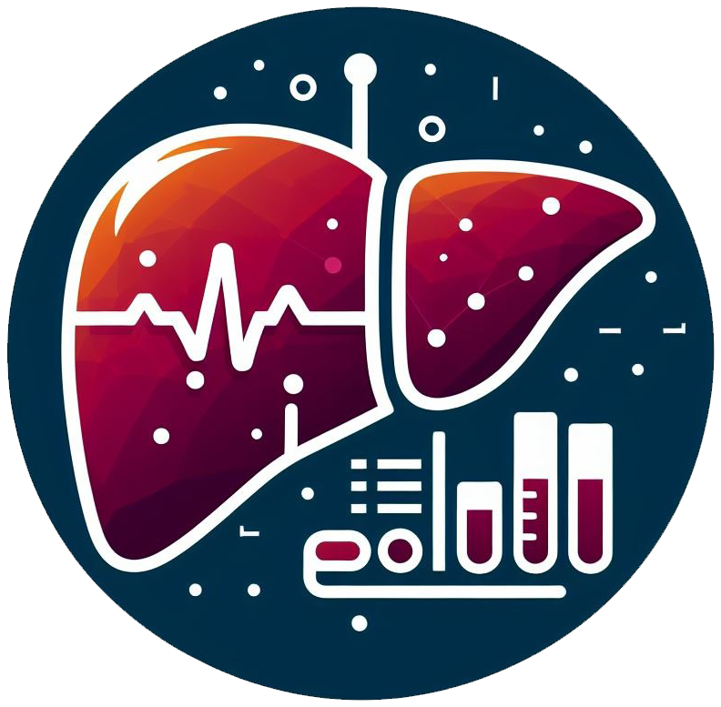
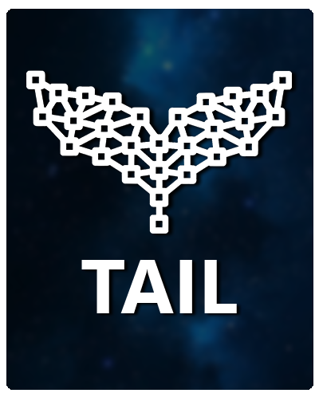
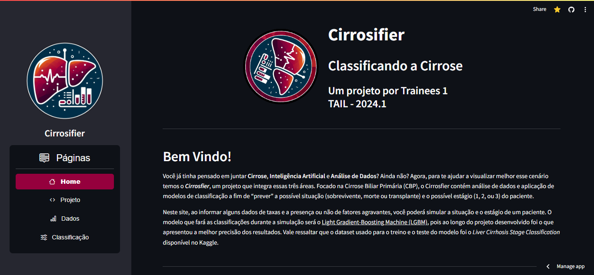
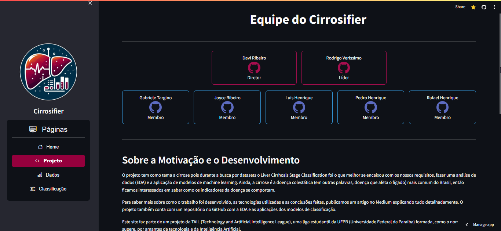
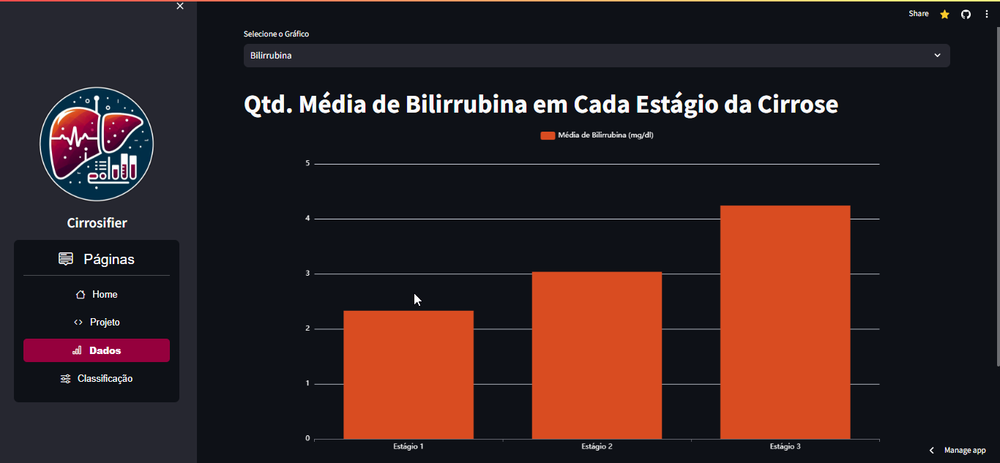
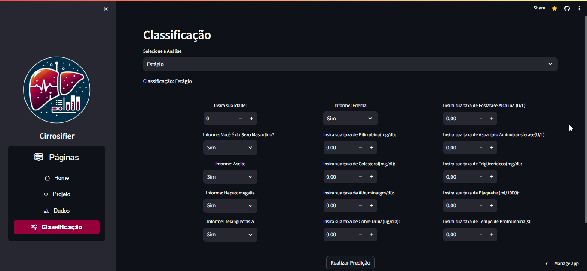
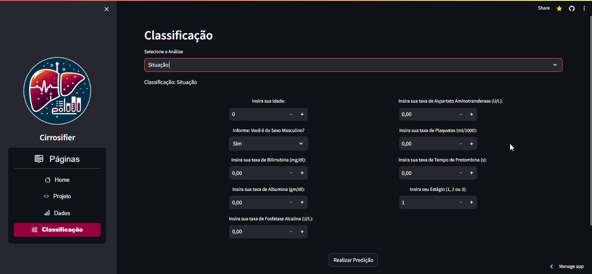

# **CirrosifierApp-TRAINEES1**

<p align="center">
  <a>
    
  </a>
</p>

<p align="center">
  <a href="https://tail-cirrosifier.streamlit.app/">
    
  </a>
</p>

<br>
<p align="center">Classificador de Estágio e Situação da Cirrose Biliar Primária</p>
<br>
<br>

Tabela de conteúdos
=================
1. [Sobre](#sobre)
2. [Features](#features)
3. [Interface Inicial](#interface-inicial)
4. [Calculadora de Juros Compostos](#calculadora-de-juros-compostos)
5. [Recomendador de Investimentos](#recomendador-de-investimentos)
6. [Histórico de Ações](#histórico-de-ações)
7. [Como rodar localmente](#como-rodar-localmente)
8. [Tecnologias e Ferramentas](#tecnologias-e-ferramentas)
9. [Autores](#autores)
10. [Repositório do Projeto de desenvolvimento dos Modelos](#repositório-do-projeto-de-desenvolvimento-dos-modelos)

### Sobre <a name="sobre"></a>

O Cirrosfier é um projeto proveniente da rotação de Trainees 1,
da [**TAIL**](https://tail-tech.com/) _(Technology and Artificial Intelligence League)_. A rotação tem como intuito ensinar e introduzir novos integrantes aos conceitos e práticas de Aprendizado de Máquina e Inteligência Artificial. Durante a rotação, foram desenvolvidos 4 modelos para classificar tanto o Estágio do paciente (1, 2 e 3), quanto a Situação ('Sobreviveu', 'Transplante', 'Morte'). Como fruto dessa prática, no Cirrosifier implantamos os dois, modelos que obtiveram melhor acurácia por classificação, que em ambos os casos, foi o modelo de Light Gradient Boost Machine. Este aplicativo não estava inicialmente no escopo do projeto, mas ao fim da rotação, a equipe decidiu desenvolvê-lo para trazer algo novo e concreto. Mais pra frente estará disponível o link para o repositório do projeto de Análise de Dados e Desenvolvimento dos Modelos.



Confira o site da **TAIL**

> [**Repositório do Projeto de Análise de Dados e Modelagem**](https://github.com/rodrigo0567/Cirrosifier-TRAINEES1)

### Features

- [x] Homepage
- [x] Descrição do projeto, membros e o que foi desenvolvido.
- [x] Visualização de Dados
- [x] Classificação de Estágio
- [x] Classificação da Situação

### Interface Inicial

<p align="center">
  <a>
    
  </a>
</p>
<br>

### Descrição do Projeto
<p align="center">
  <a>
     </img>
  </a>
</p>
<br>

### Visualização de Dados
<p align="center">
  <a>
    
  </a>
</p>
<br>

### Classificação de Estágio
<p align="center">
  <a>
    </img>
  </a>
</p>
<br>

### Classificação de Situação
<p align="center">
  <a>
    </img>
  </a>
</p>
<br>

### Como rodar localmente

Caso queira rodar localmente, você irá inicialmente precisar dessas ferramentas instaladas:

* [Git](https://git-scm.com), 
* [Python](https://www.python.org/downloads/)

Além disto é preferível que se tenha uma IDE para manipular o projeto como o [VSCode](https://code.visualstudio.com/).

### 🎲 Rodando Localmente

Primeiramente clone o projeto
```bash
# Clone este repositório
$ git clone git@github.com:ricktherunner/CirrosifierApp-TRAINEES1.git

# Acesse a pasta do projeto no terminal/cmd
$ cd CirrosifierApp-TRAINEES1
````

Para instalar as dependências, recomendamos que primeiro crie um ambiente virtual.

````bash
# Crie o ambiente
python -m venv myenv

# Ative o ambiente
myenv\Scripts\activate
````

Agora pode instalar as dependências
````bash
# Instale as dependências
$ pip install -r requirements.txt
````

Por fim, rode a aplicação
````bash
# Execute a aplicação em modo de desenvolvimento
$ python -m streamlit run app.py

# O servidor inciará na porta:8501 - acesse <http://localhost:8501>
````
<br>

### Tecnologias e Ferramentas

As seguintes ferramentas foram usadas na construção do projeto:

- [Python](https://www.python.org/)
- [Streamlit](https://streamlit.io/)
- [Pandas](https://pandas.pydata.org/)
<br>

Confira o que foi usado no desenvolvimento dos modelos em:

**Cirrosifier-TRAINEES1**

* 


<br>


### Autores

<table>
  <tr>
    <!-- Líderes -->
    <td align="center">
      <a href="https://github.com/rodrigo0567">
        
        <br />
        <sub><b>Rodrigo Veríssimo</b></sub>
      </a>
      <br/>
      <b>
      <a href="https://github.com/rodrigo0567" target="_blank" >
        
      </a>
    </td>
    <td align="center">
      <a href="https://github.com/davirpp">
        
        <br />
        <sub><b>Davi Ribeiro</b></sub>
      </a>
      <br />
      <a href="https://github.com/davirpp" target="_blank">
        
      </a>
    </td>
  </tr>
  <tr>
    <!-- Membros -->
    <td align="center">
      <a href="https://github.com/gabitargino">
        
        <br />
        <sub><b>Gabriele Targino</b></sub>
      </a>
      <br />
      <a href="https://github.com/gabitargino" target="_blank">
        
      </a>
    </td>
    <td align="center">
      <a href="https://github.com/Joyce-Ribeiro">
        
        <br />
        <sub><b>Joyce Ribeiro</b></sub>
      </a>
      <br />
      <a href="https://github.com/Joyce-Ribeiro" target="_blank">
        
      </a>
    </td>
  </tr>
  <tr>
    <td align="center">
      <a href="https://github.com/luyluish">
        
        <br />
        <sub><b>Luis Henrique</b></sub>
      </a>
      <br />
      <a href="https://github.com/luyluish" target="_blank">
        
      </a>
    </td>
    <td align="center">
      <a href="https://github.com/ricktherunner">
        
        <br />
        <sub><b>Pedro Henrique</b></sub>
      </a>
      <br />
      <a href="https://github.com/ricktherunnerr" target="_blank">
        
      </a>
    </td>
  </tr>
  <tr>
    <td align="center">
      <a href="https://github.com/rafaelhenrique-ra">
        
        <br />
        <sub><b>Rafael Henrique</b></sub>
      </a>
      <br />
      <a href="https://github.com/rafaelhenrique-ra" target="_blank">
        
      </a>
    </td>
  </tr>
</table>
<br>

### Repositório do Projeto de desenvolvimento dos Modelos

<table>
  <tr>
    <!-- Líderes -->
    <td align="center">
      <a href="https://github.com/rodrigo0567/Cirrosifier-TRAINEES1">
        
        <br />
        <sub><b>Cirrosifier-TRAINEES1</b></sub>
      </a>
      <br/>
      <b>
      <a href="https://github.com/rodrigo0567/Cirrosifier-TRAINEES1" target="_blank" >
        
      </a>
    </td>

